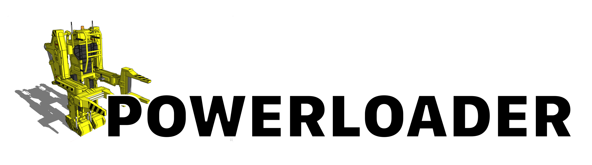

# The POWERLOADER

**Note: the code in here is very, very much a work in progress. Please do not use it!**

This is a tool to download large files. This is to be used in `mamba` and potentially other package managers. It's a port of `librepo`, but extends it in several ways as well as being cross-platform (it should support Windows as well).

Current WIP features are:

- Mirror support and automatic mirror selection
- Native OCI registry and S3 bucket support
- Resumable downloads
- zchunk support for delta-downloads

In the future this might be directly integrated into the `mamba` codebase -- or live seperately.

### Try it out

Install dependencies:

`mamba create -n test -c conda-forge cli11 zchunk libcurl fmt openssl cmake compilers ninja`

Then you can run

```
conda activate test

mkdir build; cd build
cmake .. -GNinja
ninja

./powerloader --help
```
